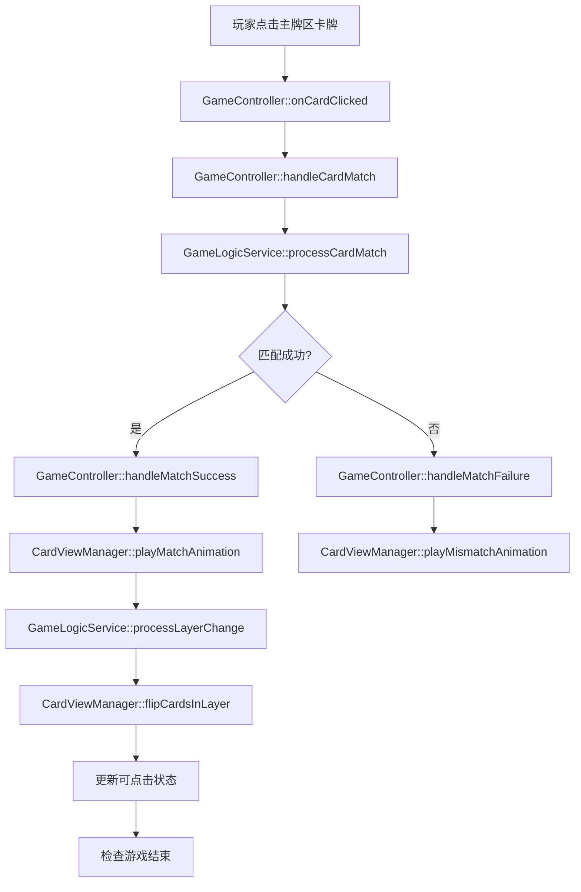
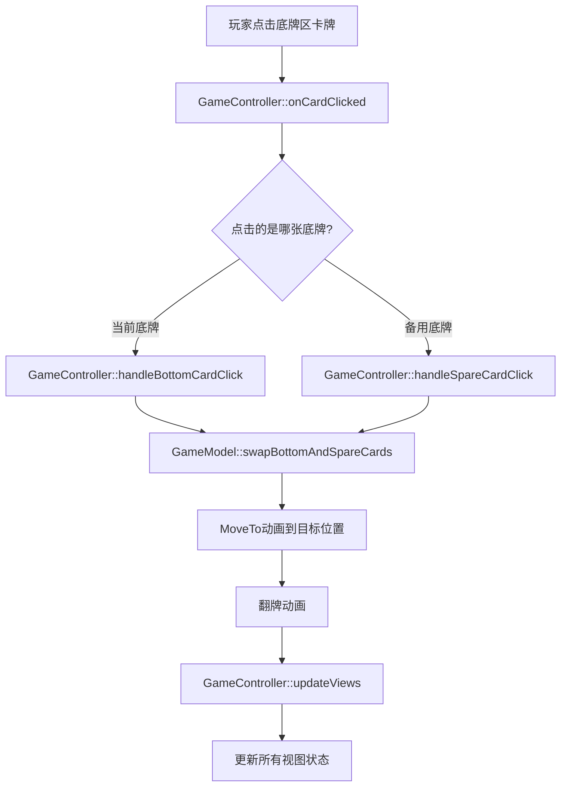

# 卡牌游戏代码拆解文档

## 📋 项目概述

本项目是一个基于Cocos2d-x的卡牌匹配游戏，采用MVC架构设计。游戏界面分为**主牌区**和**底牌区**两个核心区域，实现分层卡牌匹配和双底牌切换机制。

## 🎮 游戏逻辑结构树

```
卡牌游戏 (CardGame)
├── 主牌区 (MainCardArea)
│   ├── 3x3网格布局
│   ├── 分层显示 (Layer 0-2)
│   ├── 匹配逻辑
│   └── 层级翻牌
└── 底牌区 (BottomCardArea)
    ├── 当前底牌 (正面朝上，可匹配)
    └── 备用底牌 (背面朝下，不可匹配)
```

## 🏗️ 架构层级分解

### 1. 数据模型层 (Models)

#### GameModel (`Classes/models/GameModel.h/cpp`)
**职责**: 游戏核心数据管理

**主牌区相关**:
```cpp
// 数据成员
std::vector<CardModel> _mainCards;        // 主牌区卡牌数据
int _currentAvailableLayer;               // 当前可点击层级
std::vector<bool> _layerCleared;          // 各层清空状态

// 关键方法
const std::vector<CardModel>& getMainCards() const;
std::vector<CardModel*> getCardsInLayer(int layer);
bool isCardClickable(const CardModel& card) const;
```

**底牌区相关**:
```cpp
// 数据成员
CardModel _bottomCard;                    // 当前底牌
CardModel _spareCard;                     // 备用底牌

// 关键方法
const CardModel& getBottomCard() const;
const CardModel& getSpareCard() const;
void swapBottomAndSpareCards();           // 双底牌切换核心方法
```

#### CardModel (`Classes/models/CardModel.h/cpp`)
**职责**: 单张卡牌数据

```cpp
// 核心属性
int _id;                    // 卡牌唯一标识
CardSuit _suit;            // 花色
CardRank _rank;            // 点数
bool _faceUp;              // 正反面状态
int _layer;                // 所属层级
int _gridIndex;            // 网格索引

// 关键方法
bool canMatchWith(const CardModel& other) const;  // 匹配判断
void setLayer(int layer);                         // 设置层级
void setFaceUp(bool faceUp);                     // 设置翻面状态
```

### 2. 视图层 (Views)

#### CardView (`Classes/views/CardView.h/cpp`)
**职责**: 单张卡牌视觉表现

**主牌区功能**:
```cpp
// 翻牌动画
void flipCardWithAnimation(const std::function<void()>& callback);
void playFlipAnimation(const std::function<void()>& callback);  // 纯视觉翻牌

// 匹配动画
void playMatchAnimation(const std::function<void()>& callback);
void playMismatchAnimation();

// 状态管理
void setInteractable(bool interactable);  // 可点击状态
void updateDisplay();                     // 更新显示
```

**底牌区功能**:
```cpp
// 基础显示
void setFaceUp(bool faceUp);             // 设置正反面
void setCardModel(const CardModel& model); // 更新卡牌数据

// 触摸事件
void initTouchEvents();                   // 初始化点击事件
```

### 3. 管理器层 (Managers)

#### CardViewManager (`Classes/managers/CardViewManager.h/cpp`)
**职责**: 卡牌视图统一管理

**主牌区管理**:
```cpp
// 视图创建
void createMainCardsView(const std::vector<CardModel>& cardModels);

// 布局计算
Vec2 calculateMainCardPosition(int index);

// 层级管理
void flipCardsInLayer(const std::vector<int>& cardIds, 
                     const std::function<void()>& callback);
void updateCardClickableStates(const GameModel& gameModel);

// 动画管理
void playMatchAnimation(int cardId, const std::function<void()>& callback);
void playMismatchAnimation(int cardId);
```

**底牌区管理**:
```cpp
// 视图创建
void createBottomCardView(const CardModel& cardModel);
void createSpareCardView(const CardModel& spareCard);

// 布局计算
Vec2 calculateBottomCardPosition();       // 当前底牌位置
Vec2 calculateSpareCardPosition();        // 备用底牌位置

// 视图更新
void updateBottomCard(const CardModel& cardModel);
void updateBottomCardsView(const GameModel& gameModel);
```

### 4. 控制器层 (Controllers)

#### GameController (`Classes/controllers/GameController.h/cpp`)
**职责**: 游戏逻辑控制中心

**主牌区控制逻辑**:
```cpp
// 点击处理
void handleCardMatch(int cardId);         // 主牌匹配处理
void handleMatchSuccess(int cardId);      // 匹配成功处理
void handleMatchFailure(int cardId);      // 匹配失败处理

// 事件触发流程
onCardClicked(cardId) 
  → handleCardMatch(cardId)
    → GameLogicService::processCardMatch()
      → handleMatchSuccess() / handleMatchFailure()
        → GameLogicService::processLayerChange()
          → CardViewManager::flipCardsInLayer()
```

**底牌区控制逻辑**:
```cpp
// 双底牌切换
void handleBottomCardClick(int cardId);   // 当前底牌点击
void handleSpareCardClick(int cardId);    // 备用底牌点击

// 事件触发流程
onCardClicked(cardId)
  → handleBottomCardClick() / handleSpareCardClick()
    → GameModel::swapBottomAndSpareCards()
      → MoveTo动画 + 翻牌动画
        → updateViews()
```

### 5. 服务层 (Services)

#### GameLogicService (`Classes/services/GameLogicService.h/cpp`)
**职责**: 游戏规则逻辑

**主牌区逻辑**:
```cpp
// 匹配处理
static bool processCardMatch(GameModel& gameModel, int cardId);
static bool canMatch(const CardModel& card1, const CardModel& card2);

// 层级管理
static std::vector<int> processLayerChange(GameModel& gameModel);
static bool hasAvailableMatches(const GameModel& gameModel);
```

#### CardGeneratorService (`Classes/services/CardGeneratorService.h/cpp`)
**职责**: 卡牌生成逻辑

```cpp
// 初始化生成
static void generateInitialCards(GameModel& gameModel, int mainCardCount);

// 双底牌生成
static void generateNewBottomCard(GameModel& gameModel);  // 简化为切换逻辑
```

## 🔄 核心业务流程

### 主牌区匹配流程



### 底牌区切换流程



## 📝 常见修改指南

### 修改主牌区布局
**位置**: `CardViewManager::calculateMainCardPosition()`
**文件**: `Classes/managers/CardViewManager.cpp`
```cpp
// 修改网格布局、间距、起始位置
Vec2 CardViewManager::calculateMainCardPosition(int index)
{
    // 在这里修改布局逻辑
}
```

### 修改匹配规则
**位置**: `GameLogicService::canMatch()`
**文件**: `Classes/services/GameLogicService.cpp`
```cpp
// 修改卡牌匹配条件
bool GameLogicService::canMatch(const CardModel& card1, const CardModel& card2)
{
    // 在这里修改匹配规则
}
```

### 修改底牌区位置
**位置**: `CardViewManager::calculateBottomCardPosition()` 和 `calculateSpareCardPosition()`
**文件**: `Classes/managers/CardViewManager.cpp`
```cpp
// 修改底牌区布局
Vec2 CardViewManager::calculateBottomCardPosition() { /* 修改位置 */ }
Vec2 CardViewManager::calculateSpareCardPosition() { /* 修改位置 */ }
```

### 修改动画效果
**位置**: `CardView` 类的动画方法
**文件**: `Classes/views/CardView.cpp`
```cpp
// 修改翻牌动画
void CardView::playFlipAnimation() { /* 修改动画参数 */ }

// 修改匹配动画
void CardView::playMatchAnimation() { /* 修改动画效果 */ }
```

### 修改游戏配置
**位置**: `GameConfig` 类
**文件**: `Classes/configs/GameConfig.h/cpp`
```cpp
// 修改游戏参数
struct GameSettings {
    static const int MAIN_CARDS_COUNT = 9;  // 主牌区卡牌数量
    static const int GRID_ROWS = 3;         // 网格行数
    static const int GRID_COLS = 3;         // 网格列数
    // ...
};
```

## 🎯 关键事件触发点

| 事件 | 触发位置 | 处理方法 | 影响区域 |
|------|----------|----------|----------|
| 主牌点击 | `CardView::onTouchBegan` | `GameController::handleCardMatch` | 主牌区 + 底牌区 |
| 底牌点击 | `CardView::onTouchBegan` | `GameController::handleBottomCardClick` | 底牌区 |
| 备用底牌点击 | `CardView::onTouchBegan` | `GameController::handleSpareCardClick` | 底牌区 |
| 匹配成功 | `GameLogicService::processCardMatch` | `GameController::handleMatchSuccess` | 主牌区层级 |
| 层级变化 | `GameLogicService::processLayerChange` | `CardViewManager::flipCardsInLayer` | 主牌区显示 |
| ~~游戏结束~~ | ~~`GameController::checkGameEnd`~~ | ~~`notifyGameWin/Over`~~ | ~~全局状态~~ (DEMO模式已注释) |

## 🔧 详细修改示例

### 示例1: 修改主牌区为5x3布局

**步骤1**: 修改配置
```cpp
// 文件: Classes/configs/GameConfig.h
struct GameSettings {
    static const int MAIN_CARDS_COUNT = 15;  // 改为15张牌
    static const int GRID_ROWS = 3;          // 保持3行
    static const int GRID_COLS = 5;          // 改为5列
};
```

**步骤2**: 修改布局计算
```cpp
// 文件: Classes/managers/CardViewManager.cpp
Vec2 CardViewManager::calculateMainCardPosition(int index)
{
    int row = index / 5;  // 改为5列
    int col = index % 5;  // 改为5列
    // 调整间距和起始位置...
}
```

**步骤3**: 修改层级计算
```cpp
// 文件: Classes/services/CardGeneratorService.cpp
int layer = i / 5;  // 改为按5列计算层级
```

### 示例2: 修改匹配规则为相同花色

**位置**: `Classes/services/GameLogicService.cpp`
```cpp
bool GameLogicService::canMatch(const CardModel& card1, const CardModel& card2)
{
    // 原规则: 相同点数
    // return card1.getRank() == card2.getRank();

    // 新规则: 相同花色
    return card1.getSuit() == card2.getSuit();
}
```

### 示例3: 添加新的动画效果

**位置**: `Classes/views/CardView.cpp`
```cpp
void CardView::playCustomAnimation()
{
    // 添加自定义动画
    auto scaleUp = ScaleTo::create(0.2f, 1.2f);
    auto scaleDown = ScaleTo::create(0.2f, 1.0f);
    auto sequence = Sequence::create(scaleUp, scaleDown, nullptr);
    this->runAction(sequence);
}
```

### 示例4: 修改底牌区为三张底牌

**步骤1**: 修改数据模型
```cpp
// 文件: Classes/models/GameModel.h
private:
    CardModel _bottomCard;      // 当前底牌
    CardModel _spareCard1;      // 备用底牌1
    CardModel _spareCard2;      // 备用底牌2
```

**步骤2**: 添加切换逻辑
```cpp
// 文件: Classes/models/GameModel.cpp
void GameModel::cycleBottomCards()
{
    CardModel temp = _bottomCard;
    _bottomCard = _spareCard1;
    _spareCard1 = _spareCard2;
    _spareCard2 = temp;
}
```

## 🎨 UI界面修改指南

### 窗口大小/分辨率修改
**位置**: `Classes/AppDelegate.cpp`
```cpp
// 修改设计分辨率
glview->setDesignResolutionSize(1920, 1080, ResolutionPolicy::NO_BORDER);
```

**影响的位置计算**:
- `CardViewManager::calculateBottomCardPosition()`
- `CardViewManager::calculateSpareCardPosition()`
- `CardViewManager::calculateMainCardPosition()`

### 卡牌资源修改
**位置**: `Classes/configs/GameConfig.h`
```cpp
struct ResourceSettings {
    static const std::string CARD_FRONT_FORMAT;  // 正面资源格式
    static const std::string CARD_BACK_TEXTURE;  // 背面资源路径
};
```

### 添加音效
**位置**: `Classes/views/CardView.cpp`
```cpp
void CardView::flipCardWithAnimationAndSound()
{
    // 播放翻牌音效
    AudioEngine::play2d("sounds/card_flip.mp3", false, 0.5f);
    flipCardWithAnimation();
}
```

## 🐛 常见问题排查

### 问题1: 卡牌点击无响应
**排查位置**:
1. `CardView::initTouchEvents()` - 检查触摸事件是否正确初始化
2. `GameController::onCardClicked()` - 检查点击回调是否正确设置
3. `CardViewManager::setCardClickCallback()` - 检查回调函数绑定

### 问题2: 动画不流畅
**排查位置**:
1. `CardView` 动画方法 - 检查动画参数和时长
2. `GameConfig::LayerSettings` - 检查动画配置常量
3. 检查是否有重复的动画冲突

### 问题3: 层级显示错误
**排查位置**:
1. `CardGeneratorService::generateInitialCards()` - 检查层级分配逻辑
2. `GameLogicService::processLayerChange()` - 检查层级变化处理
3. `CardViewManager::createMainCardsView()` - 检查Z-order设置

### 问题4: 底牌切换异常
**排查位置**:
1. `GameModel::swapBottomAndSpareCards()` - 检查数据交换逻辑
2. `GameController::handleBottomCardClick()` - 检查动画和回调
3. `CardViewManager::updateViews()` - 检查视图更新

## 📊 性能优化建议

### 减少视图重建
```cpp
// 优化前: 频繁重建视图
void updateAllViews() {
    clearAllCardViews();
    createAllViews();
}

// 优化后: 只更新必要部分
void updateSpecificViews() {
    updateChangedCardsOnly();
}
```

### 动画优化
```cpp
// 使用对象池避免频繁创建Action
class AnimationPool {
    static Action* getFlipAnimation();
    static void returnFlipAnimation(Action* action);
};
```

### 内存管理
```cpp
// 及时释放不需要的CardView
void CardViewManager::removeCardView(int cardId) {
    auto it = _cardViews.find(cardId);
    if (it != _cardViews.end()) {
        it->second->removeFromParent();
        _cardViews.erase(it);
    }
}
```

---

## 🎮 DEMO模式说明

**当前项目处于DEMO模式，游戏结束判定已被注释掉，便于测试游戏逻辑。**

### 已注释的游戏结束判定代码

#### 1. GameController.cpp
```cpp
// 第175行 - handleMatchSuccess中的调用
// checkGameEnd();

// 第284-301行 - checkGameEnd方法实现
void GameController::checkGameEnd()
{
    // DEMO模式：注释掉游戏结束判定，让游戏可以无限进行
    /*
    if (_gameModel->getMainCardCount() == 0)
    {
        // 游戏胜利
        _gameModel->setGameState(GameModel::WIN);
        notifyGameWin();
    }
    else if (!GameLogicService::hasAvailableMatches(*_gameModel))
    {
        // 没有可用匹配且牌堆为空，游戏失败
        _gameModel->setGameState(GameModel::LOSE);
        notifyGameOver();
    }
    */
}
```

#### 2. GameLogicService.cpp
```cpp
// 第41-47行 - processCardMatch中的胜利判定
/*
if (gameModel.getMainCardCount() == 0)
{
    gameModel.setGameState(GameModel::WIN);
}
*/

// 第55-76行 - checkGameOver方法
bool GameLogicService::checkGameOver(const GameModel& gameModel)
{
    // DEMO模式：总是返回false，避免游戏结束判定
    return false;
    // ... 原始逻辑已注释
}

// 第86-109行 - hasAvailableMatches方法
bool GameLogicService::hasAvailableMatches(const GameModel& gameModel)
{
    // DEMO模式：总是返回true，避免游戏结束判定
    return true;
    // ... 原始逻辑已注释
}
```

#### 3. GameModel.cpp
```cpp
// 第52-72行 - 游戏状态判定方法
bool GameModel::isGameWon() const
{
    // DEMO模式：总是返回false，避免游戏胜利判定
    return false;
    // ... 原始逻辑已注释
}

bool GameModel::isGameOver() const
{
    // DEMO模式：总是返回false，避免游戏结束判定
    return false;
    // ... 原始逻辑已注释
}
```

### 恢复游戏结束判定

如需恢复正常的游戏结束判定，请：

1. **取消注释上述代码块**
2. **删除DEMO模式的返回语句**
3. **重新编译项目**

### DEMO模式的优势

- ✅ **无限测试**: 游戏不会因为胜利或失败而结束
- ✅ **逻辑验证**: 可以专注测试匹配逻辑和动画效果
- ✅ **UI调试**: 便于调试界面布局和交互效果
- ✅ **性能测试**: 可以长时间运行测试性能表现

---

**📚 使用建议**:
- 修改游戏逻辑时，先确定要修改的区域（主牌区/底牌区）
- 找到对应的Controller方法作为入口点
- 根据需要修改Model数据结构或View显示效果
- 测试时重点关注事件触发链的完整性
- 大型修改前建议先备份代码并创建测试分支
- **DEMO模式下可以无限测试各种游戏逻辑组合**
