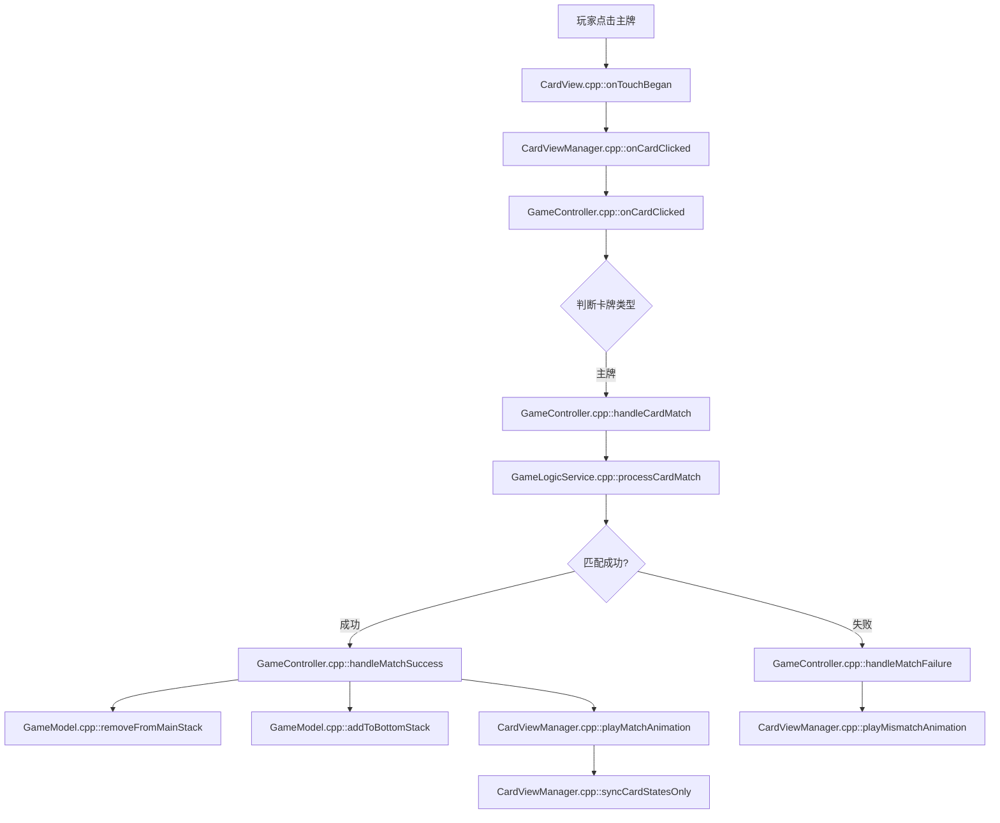
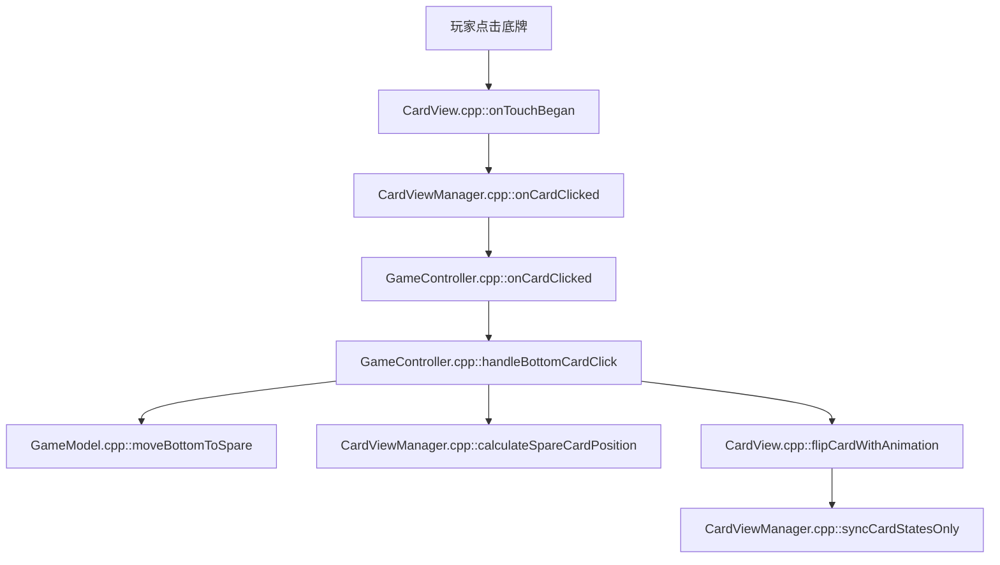
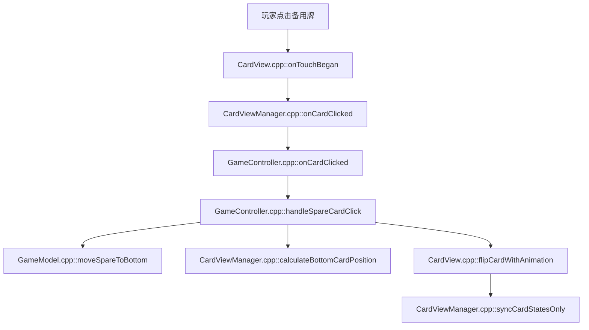

# 卡牌游戏程序设计文档

基于Cocos2d-x的卡牌匹配游戏，将游戏主界面划分为主牌区、底牌区和备用牌区三个功能区域。采用**统一**的管理架构，实现了三个卡牌区域的一致性设计。

## 新加卡牌数量

直接更改GameConfig.h中的对应牌种的CARD_COUNT参数即可。
> 在GameConfig中可以设置游戏的所有相关参数，包括牌的数量、牌堆大小、牌堆位置、牌堆间距等。


---
AI - Visualization
## 🔄 **玩家操作回馈流程图**

### **主牌点击匹配流程**



### **底牌切换流程**



### **备用牌激活流程**



### **关键方法调用链**

#### **🎯 点击事件传递链**

```
用户点击 → CardView::onTouchBegan()
        → CardViewManager::onCardClicked()
        → GameController::onCardClicked()
        → GameController::handle[CardType]Click()
```

#### **🔄 数据更新链**

```
GameModel::removeFromMainStack() → GameModel::addToBottomStack()
                                → CardViewManager::syncCardStatesOnly()
                                → CardView::updateDisplay()
```

#### **🎬 动画执行链**

```
GameController::handleMatchSuccess() → CardViewManager::playMatchAnimation()
                                   → CardView::runAction()
                                   → Cocos2d-x动画系统
```


